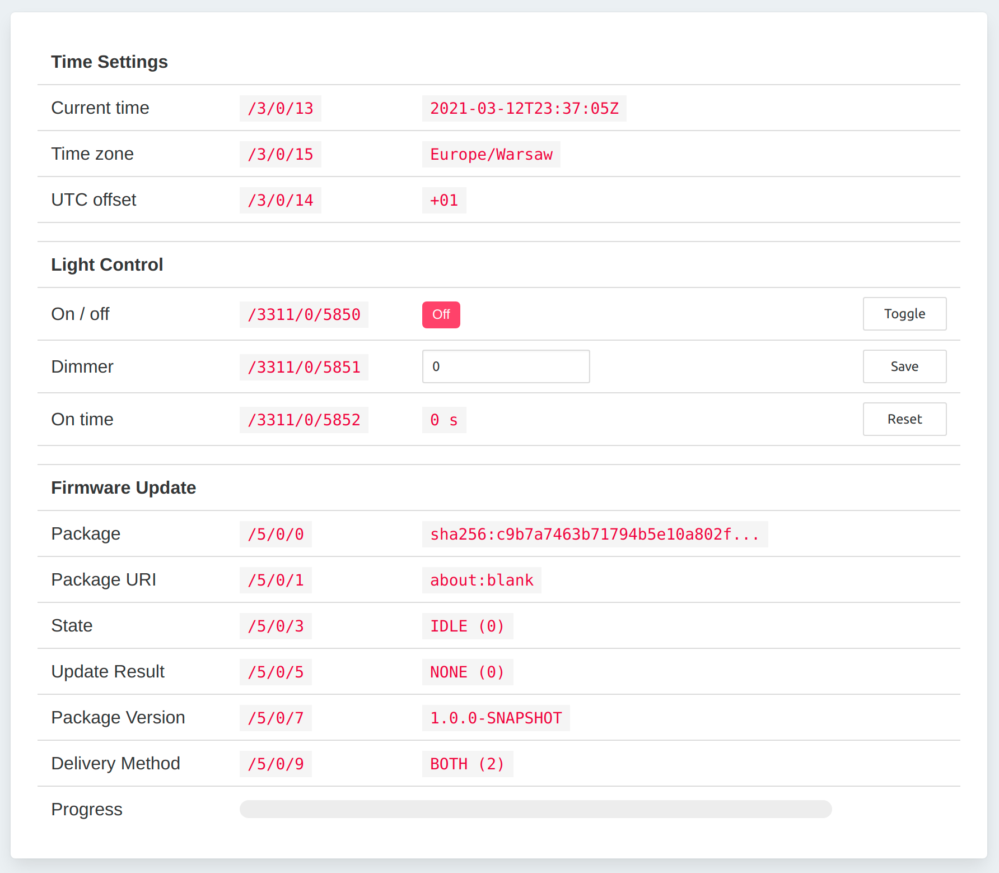

# iEmu - IoT Device Emulator

Emulator application for an IoT device (with LwM2M).

## Table of Contents

- [Features](#features)
- [Application](#application)
- [Configuration Profiles](#configuration-profiles)
- [Build & Run](#build--run)
    - [Prerequisites](#prerequisites)
    - [Run with IDE](#run-with-ide)
    - [Run with Gradle `application` plugin](#run-with-gradle-application-plugin)
    - [Build and run distribution](#build-and-run-distribution)
    - [Run with Docker](#run-with-docker)
- [Technologies](#technologies)

## Features

1. LwM2M protocol support for objects:
    * `LwM2M Server (1)`,
    * `Device (3)`,
    * `Firmware Update (5)`,
    * `Light Control (3311)`.
2. HTTP UI for device management (REST API and Angular UI).
3. Docker build.

## Application

Application has just one view, displaying (refreshing automatically thanks to websocket connection) management UI for
the device.

<div align="center">
  
</div>

## Configuration Profiles

It's possible to define multiple `.yml` files within `data/` directory and control profile name with `--{profile}`
program argument.

Consider following configuration files:

```bash
$ tree data/
data
├── config.yml
└── config-demo.yml
```

Then selecting profile name looks following:

| config file       | gradle run                      | dist run                               |
|-------------------|---------------------------------|----------------------------------------|
| `config.yml`      | `./gradlew run`                 | `./build/install/iemu/bin/iemu`        |
| `config-demo.yml` | `./gradlew run --args="--demo"` | `./build/install/iemu/bin/iemu --demo` |

## Build & Run

Project requires **Java 25**. These instructions describe how to run using Gradle task.

### Prerequisites

1. Run LwM2M server (consider Leshan Demo Server from [official repository][leshan] or check [here][leshan-demo-server]
   on how to use Leshan's playground).
2. Set appropriate configuration in `data/config.yml` (see `data/config-demo.yml` if using Leshan's playground). See
   also chapter about [configuration profiles](#configuration-profiles).

No need to compile Angular, as static dist files from [`webapp`](./webapp) are included as static resources in `jar`.

### Run with IDE

Simply locate `App` class and run it's `main` method.

### Run with Gradle `application` plugin

Project uses Gradle [`application`][application-plugin] plugin. To run
application from Gradle, simply use `run` task.

```bash
./gradlew run
```

To run application with `demo` profile, use following command.

```bash
./gradlew run --args="--demo"
```

Then, browse [client UI](http://localhost:4500/) or check in your LwM2M server if the client is connected.

### Build and run distribution

Run `install` task to produce `build/install/` output. This project does not produce a fat jar, it relies on Gradle
`application` plugin only.

```bash
./gradlew install
```

Then, simply call `iemu` executable script from `bin/` directory. It launches application using jars from `lib/`
directory.

```bash
./build/install/iemu/bin/iemu
```

To run application with `demo` profile, use following command.

```bash
./build/install/iemu/bin/iemu --demo
```

For more info about see [Building the distribution][the-distribution] chapter.

### Run with Docker

Docker images are not being published yet. You may build Docker image using `Dockerfile` (it contains all necessary
build stages and proper base image versions).

```bash
docker build -t iemu .
```

Run that image with following command.

```bash
docker run -p 127.0.0.1:4500:4500 iemu
```

Use `APP_ARGS` environment variable to set application profile.

```bash
docker run -p 127.0.0.1:4500:4500 --env APP_ARGS=--demo iemu
```

## Technologies

- [Javalin](https://javalin.io)
- [Leshan](https://github.com/eclipse/leshan)
- [Angular](https://angular.io)
- [Docker](https://www.docker.com/) (image is not being published yet)

[leshan]: https://github.com/eclipse/leshan

[leshan-demo-server]: https://leshan.eclipseprojects.io

[application-plugin]: https://docs.gradle.org/current/userguide/application_plugin.html

[the-distribution]: https://docs.gradle.org/current/userguide/application_plugin.html#sec:the_distribution
