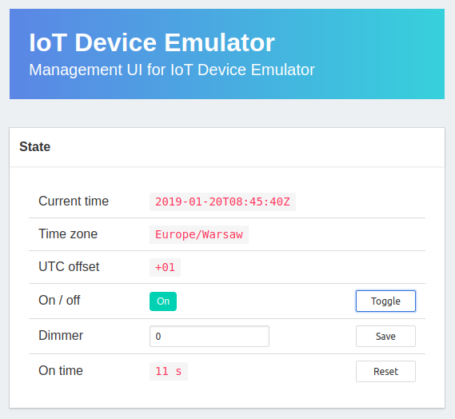

iEmu - IoT Device Emulator
==========================

Emulator application for an IoT device.

Features
--------

1. LwM2M protocol support for objects:
   * `LwM2M Server (1)`,
   * `Device (3)`,
   * `Firmware Update (5)`,
   * `Light Control (3311)`.
2. HTTP UI for device management (REST API and Angular UI).
3. Docker build.

Running
-------

1. Run LwM2M server (consider Leshan Demo Server from [official repository](https://github.com/eclipse/leshan) or check [here](https://github.com/malczuuu/leshan-demo-dockerfiles) on how to use with Docker).
2. Set appropriate configuration in `data/config.yml`. See also chapter about [configuration profiles](#configuration-profiles).
3. Build project with `./gradlew build` and run `java -jar build/libs/iemu-*.jar`. The application will load configuration from `data/config.yml` file.
4. Browse [client UI](http://localhost:4500/) or check in your LwM2M server if the client is connected.

Configuration Profiles
----------------------

It's possible to define multiple `.yml` files within `data/` directory and control profile name with `--{profile}` program argument.

Consider following configuration files:

```bash
$ tree data/
data
├── config-qa.yml
├── config-prod.yml
└── config.yml
```

Then selecting profile name looks following:

| config file       | java exec                                |
| ----------------- | ---------------------------------------- |
| `config.yml`      | `java -jar build/libs/iemu-*.jar`        |
| `config-qa.yml`   | `java -jar build/libs/iemu-*.jar --qa`   |
| `config-prod.yml` | `java -jar build/libs/iemu-*.jar --prod` |

Application
-----------

Application has just one view, displaying (refreshing automatically thanks to websocket connection) management UI for the device.

<div align="center">
  
</div>

Technologies
------------

- [Javalin](https://javalin.io)
- [Leshan](https://github.com/eclipse/leshan)
- [Angular 11](https://angular.io)
- [Docker](https://www.docker.com/)
