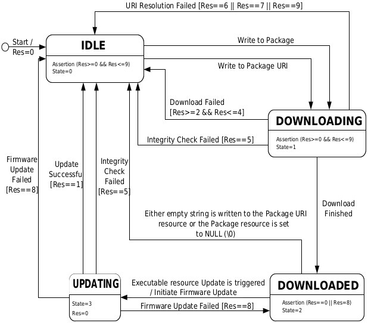
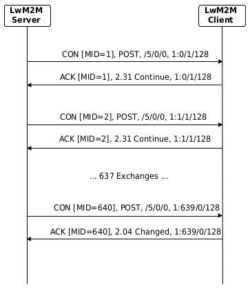

# iEmu User Guide

## Table of Contents

1. [Firmware Update Flow](#firmware-update-flow)

## Firmware Update Flow

  

  [Source][lwm2m-specification]

  

  [Source][lwm2m-specification]

[lwm2m-specification]: http://www.openmobilealliance.org/release/LightweightM2M/V1_1-20180710-A/OMA-TS-LightweightM2M_Core-V1_1-20180710-A.pdf